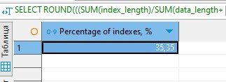
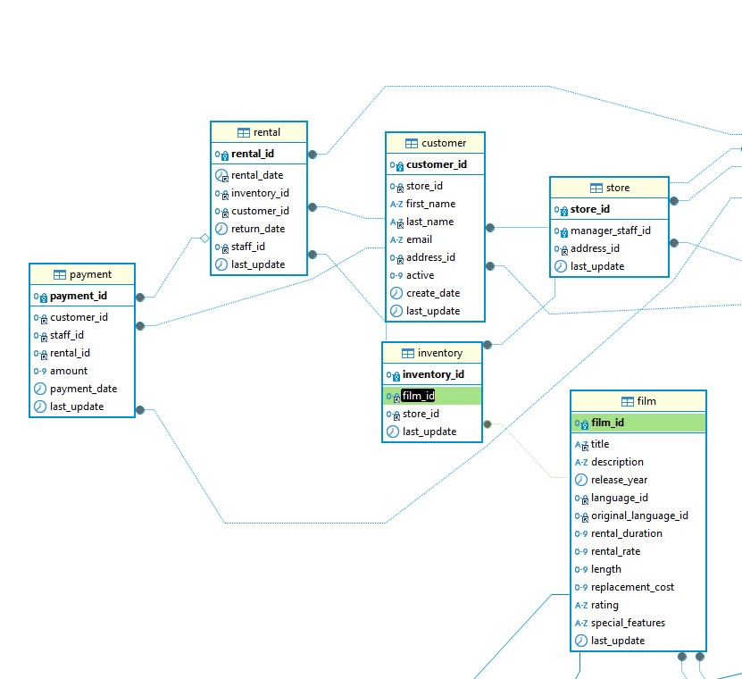
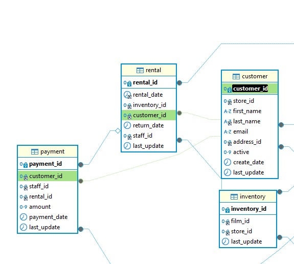
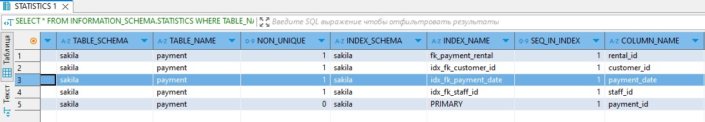

# Домашнее задание к занятию «Индексы»

### Инструкция по выполнению домашнего задания

1. Сделайте fork [репозитория c шаблоном решения](https://github.com/netology-code/sys-pattern-homework) к себе в Github и переименуйте его по названию или номеру занятия, например, https://github.com/имя-вашего-репозитория/gitlab-hw или https://github.com/имя-вашего-репозитория/8-03-hw).
2. Выполните клонирование этого репозитория к себе на ПК с помощью команды `git clone`.
3. Выполните домашнее задание и заполните у себя локально этот файл README.md:
   - впишите вверху название занятия и ваши фамилию и имя;
   - в каждом задании добавьте решение в требуемом виде: текст/код/скриншоты/ссылка;
   - для корректного добавления скриншотов воспользуйтесь инструкцией [«Как вставить скриншот в шаблон с решением»](https://github.com/netology-code/sys-pattern-homework/blob/main/screen-instruction.md);
   - при оформлении используйте возможности языка разметки md. Коротко об этом можно посмотреть в [инструкции по MarkDown](https://github.com/netology-code/sys-pattern-homework/blob/main/md-instruction.md).
4. После завершения работы над домашним заданием сделайте коммит (`git commit -m "comment"`) и отправьте его на Github (`git push origin`).
5. Для проверки домашнего задания преподавателем в личном кабинете прикрепите и отправьте ссылку на решение в виде md-файла в вашем Github.
6. Любые вопросы задавайте в чате учебной группы и/или в разделе «Вопросы по заданию» в личном кабинете.

Желаем успехов в выполнении домашнего задания.

### Задание 1

Напишите запрос к учебной базе данных, который вернёт процентное отношение общего размера всех индексов к общему размеру всех таблиц.

```
SELECT ROUND(((SUM(index_length)/SUM(data_length+index_length))*100),2) AS 'Percentage of indexes, %'
FROM INFORMATION_SCHEMA.TABLES
WHERE TABLE_SCHEMA = 'sakila';
```




### Задание 2

Выполните explain analyze следующего запроса:
```sql
select distinct concat(c.last_name, ' ', c.first_name), sum(p.amount) over (partition by c.customer_id, f.title)
from payment p, rental r, customer c, inventory i, film f
where date(p.payment_date) = '2005-07-30' and p.payment_date = r.rental_date and r.customer_id = c.customer_id and i.inventory_id = r.inventory_id
```
- перечислите узкие места;
- оптимизируйте запрос: внесите корректировки по использованию операторов, при необходимости добавьте индексы.
  
### Решение

После анализа исходного запроса было выявляено, что наиболее узким местом в предлагаемом запросе является то, что оконная функция обрабатывает излишние таблицы а именно inventory, rental и film.  Все необходимые данные есть в таблицах payment и customer, соответственно, остальные таблицы можно исключить. 
Оптимизированный запрос:

```
select distinct concat(c.last_name, ' ', c.first_name), sum(p.amount) over (partition by c.customer_id)
from payment p, customer c
where date(p.payment_date) = '2005-07-30' AND p.customer_id = c.customer_id  
```

Actual time исходного запроса составляет 6605, Actual time оптимизированного запроса составляет 9.99.

### Дополнение к решению

1. Используя таблицу inventory можно получить данные по фильмам и магазину. Т.к таблицу film мы исключаем, то отпадает неоходимость обращаться к таблице  inventory



2. На представленном ниже рисунке, прослеживется связь арендатора, аренды и оплаты. Т.к. в нашем случае мы получаем данные по арендодателю и сколько он  заплатил в определееное время, без запроса на выборку по объектам аренды, то было бы логично не задействовать таблицу rental. Также получить данные какой именно арендатор произвел оплату, можно минуя вышеуказанную таблицу.



3. Перепишем запрос

```
SELECT DISTINCT  concat(c.last_name, ' ', c.first_name) AS FIO, SUM(p.amount)
FROM payment p 
JOIN customer c ON c.customer_id = p.customer_id 
WHERE p.payment_date >= '2005-07-30' and p.payment_date < DATE_ADD('2005-07-30', INTERVAL 1 DAY)
GROUP BY FIO  
```
4. Создадим индекс по полю payment_date



5. explain analyze исходного запроса:

```

-> Table scan on <temporary>  (cost=2.5..2.5 rows=0) (actual time=6731..6731 rows=391 loops=1)
    -> Temporary table with deduplication  (cost=0..0 rows=0) (actual time=6731..6731 rows=391 loops=1)
        -> Window aggregate with buffering: sum(payment.amount) OVER (PARTITION BY c.customer_id,f.title )   (actual time=3074..6508 rows=642000 loops=1)
            -> Sort: c.customer_id, f.title  (actual time=3074..3172 rows=642000 loops=1)
                -> Stream results  (cost=21.1e+6 rows=15.6e+6) (actual time=0.456..2240 rows=642000 loops=1)
                    -> Nested loop inner join  (cost=21.1e+6 rows=15.6e+6) (actual time=0.451..1881 rows=642000 loops=1)
                        -> Nested loop inner join  (cost=19.6e+6 rows=15.6e+6) (actual time=0.447..1592 rows=642000 loops=1)
                            -> Nested loop inner join  (cost=18e+6 rows=15.6e+6) (actual time=0.442..1304 rows=642000 loops=1)
                                -> Inner hash join (no condition)  (cost=1.54e+6 rows=15.4e+6) (actual time=0.432..58.8 rows=634000 loops=1)
                                    -> Filter: (cast(p.payment_date as date) = '2005-07-30')  (cost=1.61 rows=15400) (actual time=0.0334..8.92 rows=634 loops=1)
                                        -> Table scan on p  (cost=1.61 rows=15400) (actual time=0.0211..5.22 rows=16044 loops=1)
                                    -> Hash
                                        -> Covering index scan on f using idx_title  (cost=112 rows=1000) (actual time=0.0357..0.275 rows=1000 loops=1)
                                -> Covering index lookup on r using rental_date (rental_date=p.payment_date)  (cost=0.969 rows=1.01) (actual time=0.00131..0.00175 rows=1.01 loops=634000)
                            -> Single-row index lookup on c using PRIMARY (customer_id=r.customer_id)  (cost=250e-6 rows=1) (actual time=204e-6..239e-6 rows=1 loops=642000)
                        -> Single-row covering index lookup on i using PRIMARY (inventory_id=r.inventory_id)  (cost=250e-6 rows=1) (actual time=199e-6..234e-6 rows=1 loops=642000)

```

6. explain analyze модернизированного запроса, в котором используется вновь созданный индекс idx_fk_payment_date:

```
Table scan on <temporary>  (actual time=2.98..3.03 rows=391 loops=1)
    -> Aggregate using temporary table  (actual time=2.97..2.97 rows=391 loops=1)
        -> Nested loop inner join  (cost=507 rows=634) (actual time=0.0409..2.32 rows=634 loops=1)
            -> Index range scan on p using idx_fk_payment_date over ('2005-07-30 00:00:00' <= payment_date < '2005-07-31 00:00:00'), with index condition: ((p.payment_date >= TIMESTAMP'2005-07-30 00:00:00') and (p.payment_date < <cache>(('2005-07-30' + interval 1 day))))  (cost=286 rows=634) (actual time=0.0289..1.23 rows=634 loops=1)
            -> Single-row index lookup on c using PRIMARY (customer_id=p.customer_id)  (cost=0.25 rows=1) (actual time=0.00147..0.0015 rows=1 loops=634)
```
