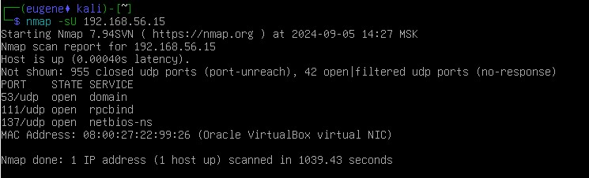

# Домашнее задание к занятию «Уязвимости и атаки на информационные системы»

### Инструкция по выполнению домашнего задания

1. Сделайте fork [репозитория c шаблоном решения](https://github.com/netology-code/sys-pattern-homework) к себе в Github и переименуйте его по названию или номеру занятия, например, https://github.com/имя-вашего-репозитория/gitlab-hw или https://github.com/имя-вашего-репозитория/8-03-hw).
2. Выполните клонирование этого репозитория к себе на ПК с помощью команды `git clone`.
3. Выполните домашнее задание и заполните у себя локально этот файл README.md:
   - впишите вверху название занятия и ваши фамилию и имя;
   - в каждом задании добавьте решение в требуемом виде: текст/код/скриншоты/ссылка;
   - для корректного добавления скриншотов воспользуйтесь инструкцией [«Как вставить скриншот в шаблон с решением»](https://github.com/netology-code/sys-pattern-homework/blob/main/screen-instruction.md);
   - при оформлении используйте возможности языка разметки md. Коротко об этом можно посмотреть в [инструкции по MarkDown](https://github.com/netology-code/sys-pattern-homework/blob/main/md-instruction.md).
4. После завершения работы над домашним заданием сделайте коммит (`git commit -m "comment"`) и отправьте его на Github (`git push origin`).
5. Для проверки домашнего задания преподавателем в личном кабинете прикрепите и отправьте ссылку на решение в виде md-файла в вашем Github.
6. Любые вопросы задавайте в чате учебной группы и/или в разделе «Вопросы по заданию» в личном кабинете.

Желаем успехов в выполнении домашнего задания.

------

### Задание 1

Скачайте и установите виртуальную машину Metasploitable: https://sourceforge.net/projects/metasploitable/.

Это типовая ОС для экспериментов в области информационной безопасности, с которой следует начать при анализе уязвимостей.

Просканируйте эту виртуальную машину, используя **nmap**.

Попробуйте найти уязвимости, которым подвержена эта виртуальная машина.

Сами уязвимости можно поискать на сайте https://www.exploit-db.com/.

Для этого нужно в поиске ввести название сетевой службы, обнаруженной на атакуемой машине, и выбрать подходящие по версии уязвимости.

Ответьте на следующие вопросы:

- Какие сетевые службы в ней разрешены?
- Какие уязвимости были вами обнаружены? (список со ссылками: достаточно трёх уязвимостей)
  
*Приведите ответ в свободной форме.*  

### Ответ 1

Разрешены следующие службы: FTP, SSH, Telnet, SMPT, Domain, HTTP, RPCBind, TCPWrapped, Exec, Login, Shell, Java-RMI, BindShell, CCProxy-FTP, MYSQL, PostgreSQL, VNC, X11, IRC, AJP13

Список уязвимостей:

1. [FTP](https://www.exploit-db.com/exploits/49757)
2. [Domain](https://www.exploit-db.com/exploits/6122)
3. [IRC](https://www.exploit-db.com/exploits/16922)

 ------
 
### Задание 2

Проведите сканирование Metasploitable в режимах SYN, FIN, Xmas, UDP.

Запишите сеансы сканирования в Wireshark.

Ответьте на следующие вопросы:

- Чем отличаются эти режимы сканирования с точки зрения сетевого трафика?
- Как отвечает сервер?

*Приведите ответ в свободной форме.*

1. Режим SYN. Nmap посылает SYN-пакет, как бы намереваясь открыть настоящее соединение, и ожидает ответ. Наличие флагов SYN|ACK в ответе указывает на то, что порт удаленной машины открыт и прослушивается. Флаг RST в ответе означает обратное. Если Nmap принял пакет SYN|ACK, то в ответ немедленно отправляет RST-пакет для сброса еще не установленного соединения

2. Режим FIN. Сканирование FIN вместо отправки полностью пустых пакетов отправляет пакет с установленным флагом FIN. Если порт закрыт, хост отвечает RST.

3. Режим Xmas. В Xmas используется пакет с набором флагов FIN|URG|PSH. ОС сканируемого хоста должна ответить на такой пакет, прибывший на закрытый порт, пакетом RST, в то время как открытый порт должен игнорировать эти пакеты.

4. Режим UDP. Этот метод используется для определения, какие UDP-порты (RFC 768) на сканируемом хосте являются открытыми. На каждый порт сканируемой машины отправляется UDP-пакет без данных. Если в ответ было получено ICMP-сообщение "порт недоступен", это означает, что порт закрыт. В противном случае предполагается, что сканируемый порт открыт.

